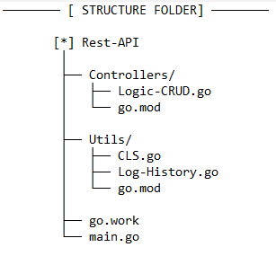

# Rest-API
Program untuk handle request GET / POST setelah itu akan di proses sesuai permintaan, dengan output berupa json data.
Untuk mendownloadnya klik [Rest-API](https://github.com/syauqqii/Popular-Programming-Technology/tree/main/Nomor%203%20-%20Rest%20API/Rest-API).

## Structure Folder

## Screenshot Program

## Penjelasan Youtube

